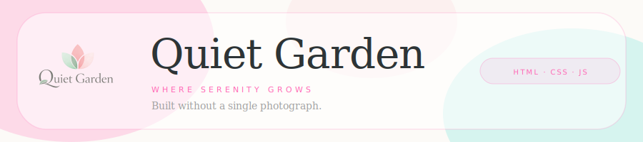

<div align="center">



</div>

---

## The idea

The constraint came before the design: no photographs.

I wanted to build something that felt genuinely delicate without relying on stock imagery or filters. A flower shop felt like the right subject, but only if the whole thing could read like a watercolour journal rather than an e-commerce template. So the rule held: every visual on the page had to be a painted illustration, and CSS had to do the work of making it feel alive.

The result is a fictional botanical brand called Quiet Garden. Not a real product. Just a creative experiment in how far CSS can carry a design on its own.

---

## How the no-photograph constraint actually works

Every image on the page is a watercolour-style illustration with a transparent background. Applying `mix-blend-mode: multiply` to each one means the painted marks blend naturally into whatever colour is behind them, rather than sitting on top as boxed images. The paper texture running underneath the entire page (a fixed pseudo-element at 20% opacity) pulls the whole thing together.

---

## What the CSS is doing

Most of the visual personality of this project lives entirely in the stylesheet.

**Blob shapes.** Every card uses a multi-value `border-radius` to produce an organic, non-geometric shape. No SVG paths. No clip-path. Just CSS:

```css
border-radius: 40% 60% 70% 30% / 50% 40% 60% 50%;
```

**Scroll animations.** Elements start invisible, slightly shifted down, and blurred. An IntersectionObserver in JavaScript adds a single class when each element enters the viewport. CSS handles the rest: opacity, transform, and blur transitions that mimic the slow spread of watercolour on paper.

**Polaroid journal cards.** The journal images sit inside white padded cards, rotated slightly. A `::before` pseudo-element on each card creates the tape strip in pink or teal, overlapping the top edge.

**The about card.** The entire about section card is rotated -0.8 degrees, giving it the feel of a piece of paper placed by hand rather than aligned to a grid.

---

## Stack

- HTML5
- CSS3 (mix-blend-mode, multi-value border-radius, radial-gradient, IntersectionObserver transitions, CSS Grid, pseudo-elements)
- Vanilla JavaScript (IntersectionObserver only, around 20 lines)
- [Dancing Script](https://fonts.google.com/specimen/Dancing+Script) via Google Fonts (decorative moments only)
- Palatino Linotype / Book Antiqua (system serif, all body copy)
- No frameworks. No build step. No photographs.

---

## Run it locally

```bash
git clone https://github.com/bytiagodev/quiet-garden-landing-page.git
cd quiet-garden-landing-page
# Open index.html in a browser. No server required.
```

---

<div align="center">

**[Live Demo](https://bytiagodev.github.io/quiet-garden-landing-page/)** · **[bytiago.com](https://bytiago.com)**

</div>
