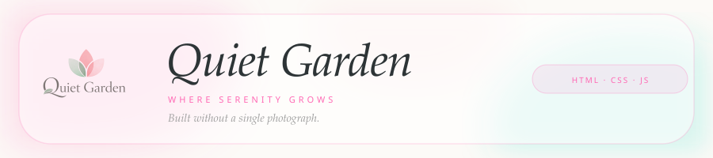

---

## The idea

I wanted to build a landing page for a fictional flower shop called Quiet Garden, but I didn't want to use standard stock photos. Instead of hunting for the right Unsplash images, I decided to use watercolour illustrations. The goal was to make the site feel like a painted journal using just HTML and CSS, rather than looking like a generic e-commerce template.

---

## How the illustrations work

Since the illustrations have transparent backgrounds, I used `mix-blend-mode: multiply` on the images. This makes the painted textures blend naturally into the background colours instead of looking like flat stickers placed on top of the page. I also added a subtle paper texture over the whole site using a fixed pseudo-element to tie everything together.

---

## What the CSS is doing

Most of the visual details are handled purely in CSS.

**Blob shapes.** The product cards use a multi-value border-radius to get an organic, uneven shape. I didn't want to use SVGs or clip-path for this, so it is just standard CSS:

`border-radius: 40% 60% 70% 30% / 50% 40% 60% 50%;`

**Scroll animations.** Elements start slightly blurred and shifted down. A small IntersectionObserver script adds a class when they enter the viewport, and CSS handles the opacity and blur transitions to mimic watercolour spreading on paper.

**Journal cards.** The blog images sit inside white padded cards that are rotated slightly. A `::before` pseudo-element creates a piece of pink or teal tape overlapping the top edge.

**The about section.** The main card in the about section is rotated by -0.8 degrees so it looks like a piece of paper resting on a desk, rather than being perfectly snapped to a grid.

---

## Stack

The project is built with plain HTML5 and CSS3. The CSS relies heavily on `mix-blend-mode`, multi-value border radius, radial gradients, and CSS Grid. The only JavaScript on the page is about 20 lines of IntersectionObserver for the scroll animations. For typography, I used Dancing Script from Google Fonts for the headings and a system serif font like Palatino Linotype for the body text. There are no frameworks and no build steps.

---

**[Live Demo](https://bytiagodev.github.io/quiet-garden-landing-page/)** · **[bytiago.com](https://bytiago.com)**

